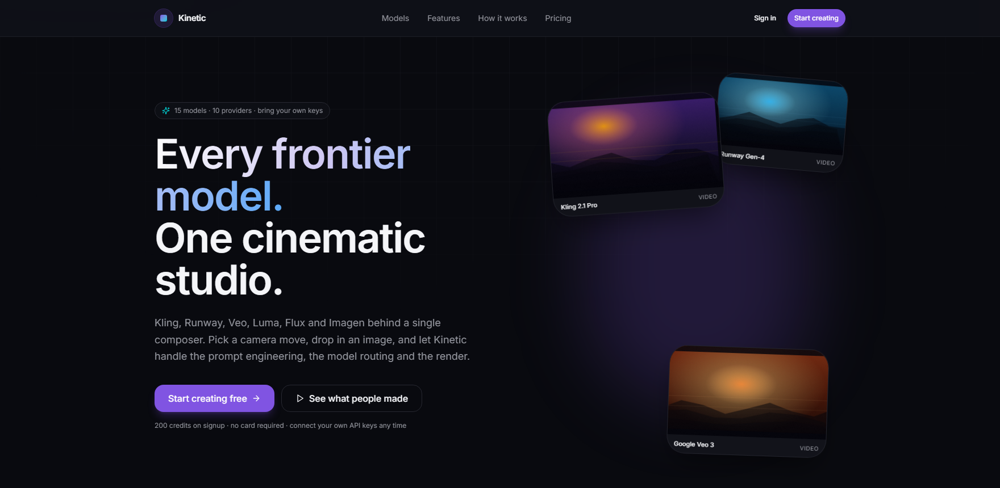

# Kinetic Studio

[Kinetic Studio - HiggsField AI Clone - Walkthrough Video](https://go.screenpal.com/watch/cOQYqqnxfJ4)

A cinematic AI creative studio — camera-move and film-style presets wrapped around
image and video generation models, with a live job feed, projects, an asset library,
a credits system, and a public feed you can publish to, like and remix from.

Built as a 24-hour MVP sprint. Inspired by the interaction model of preset-driven AI
video tools; not affiliated with any commercial service, and it ships none of their
assets or branding.

[](https://kineticstudioai.vercel.app)

**Live demo — [kineticstudioai.vercel.app](https://kineticstudioai.vercel.app)** — the
screenshot above links to it.

Signing up grants 200 credits, no card. The deployment runs `AI_PROVIDER=mock`, so
renders return bundled sample media and nothing is billed at any vendor — the credit
system, the job feed, the library and the public feed are all real.

> Full product analysis, architecture, schema and roadmap: [`docs/PLAN.md`](docs/PLAN.md)

## Stack

| | |
|---|---|
| Framework | Next.js 15 (App Router), React 19, TypeScript strict |
| UI | Tailwind CSS v4, shadcn/ui, Radix, Framer Motion, Lucide, Sonner |
| Database | Supabase Postgres, SQL migrations, RLS on every table |
| Auth | Supabase Auth (email/password + Google OAuth) |
| Storage | Supabase Storage (`uploads`, `generations`) |
| Realtime | Supabase Realtime — live job feed, no polling loop |
| AI | Provider abstraction: `mock` (default), `fal`, `replicate` |
| Deploy | Vercel |

## Getting started

### 1. Install

```bash
npm install
```

### 2. Create a Supabase project

1. Create a project at [supabase.com](https://supabase.com).
2. **Project Settings → API** — copy the project URL, the `anon` key and the
   `service_role` key.
3. **Authentication → Providers** — Email is on by default. Enable Google if you want
   OAuth (optional; email/password works alone).

### 3. Configure the environment

```bash
cp .env.example .env.local
```

Fill in `NEXT_PUBLIC_SUPABASE_URL`, `NEXT_PUBLIC_SUPABASE_ANON_KEY` and
`SUPABASE_SERVICE_ROLE_KEY`. Leave `AI_PROVIDER=mock` — the app runs end to end
with no model keys and no spend.

The service-role key bypasses row level security. It is server-only: never prefix it
with `NEXT_PUBLIC_`, never import it into a client component, never commit it.

### 4. Apply the database migrations

Either run them with the Supabase CLI:

```bash
npx supabase link --project-ref <your-project-ref>
npx supabase db push
```

Or paste each file in `supabase/migrations/` into the Supabase SQL editor, in order:

| File | What it does |
|---|---|
| `0001_schema.sql` | Enums, tables, indexes, `updated_at` triggers |
| `0002_functions.sql` | Signup bootstrap, `spend_credits`, `refund_credits`, `toggle_like` |
| `0003_rls.sql` | Row level security policies |
| `0004_storage.sql` | Storage buckets and object policies |
| `0005_realtime.sql` | Publishes `generations` to Realtime |
| `0006_hardening.sql` | Restricts `toggle_like` to published work; adds the Explore sort index |
| `0007_provider_keys.sql` | The bring-your-own-key vault behind **Settings → AI model keys** |

### 5. Seed the preset catalog

```bash
npm run seed
```

### 6. Run it

```bash
npm run dev
```

### 7. Optional: demo content

Explore is empty until somebody publishes something. After signing up:

```bash
npm run seed:demo -- --email you@example.com
```

Six finished, published shots attributed to that account. They cost zero
credits and write no ledger rows, so the balance still reconciles.

## Deploying

[`DEPLOYMENT.md`](DEPLOYMENT.md) is the checklist: the Supabase console steps
that cannot be scripted, the Vercel environment variables, and the
walkthrough that counts as acceptance.

Two health checks worth knowing:

- `GET /api/health` — 200 when Supabase is configured, reachable and seeded;
  503 naming the failing check otherwise. Booleans only, no values.
- `GET /robots.txt`, `GET /sitemap.xml` — the public surface, with every
  signed-in route disallowed.

## Architecture rules

Three conventions keep the codebase coherent:

1. **`src/app` never queries the database directly.** Routes and Server Actions call a
   service in `src/services`; services are the only layer that touches Supabase.
2. **Credits move only through SQL functions.** `spend_credits` and `refund_credits`
   are `SECURITY DEFINER`, lock the profile row, and write the ledger atomically.
   Refunds are idempotent by unique index, so a retry cannot double-credit.
3. **Providers are plugged in, never hard-coded.** Presets reference a model by
   registry id in `src/lib/ai/registry.ts`. Adding a real provider is one driver file
   plus a key — no changes to presets, services or the schema.
4. **A public page must not stream before it can 404.** `app/g/[id]` has no
   `loading.tsx` on purpose: a Suspense boundary lets Next flush the shell — and a
   200 — before the page decides to call `notFound()`, which turns every dead
   permalink into a soft 404 that crawlers read as a live page.
5. **Rate limits never guard money.** `src/lib/rate-limit.ts` is in-memory and
   per-instance — a brake on runaway clients, not a guarantee. Anything that
   must hold (credit spend, two concurrent jobs, storage scoping) is enforced
   in Postgres and RLS, where a cold start cannot forget it.
6. **Soft deletes go through the service-role client.** The `*_select_own` policies in
   `0003_rls.sql` all require `deleted_at is null`, and PostgREST wraps every UPDATE in
   a RETURNING clause — so Postgres checks those SELECT policies against the *new* row
   and rejects the statement the moment `deleted_at` is set. Deleting a project or a
   generation therefore uses the admin client with an explicit `user_id` filter, which
   is doing the scoping a policy would otherwise do.

## Scripts

| Command | Purpose |
|---|---|
| `npm run dev` | Development server |
| `npm run build` | Production build |
| `npm run typecheck` | TypeScript, no emit |
| `npm run test` | Vitest (validation schemas, provider adapter, registry, helpers) |
| `npm run seed` | Seed the preset catalogue |
| `npm run seed:demo` | Publish sample shots for one account (`-- --email you@…`) |
| `npm run db:push` | Apply migrations via the Supabase CLI |
| `npm run db:types` | Regenerate `src/types/database.ts` from the live schema |
