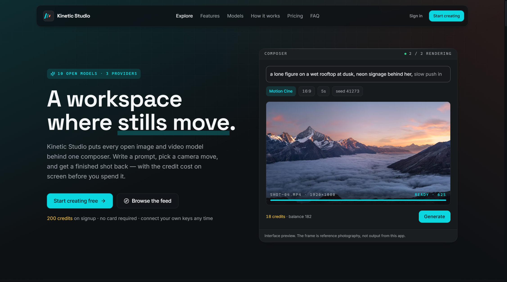

# Kinetic Studio

A cinematic AI creative studio — camera-move and film-style presets wrapped around
image and video generation models, with a live job feed, projects, an asset library,
a credits system, and a public feed you can publish to, like and remix from.

Built as a 24-hour MVP sprint. Inspired by the interaction model of preset-driven AI
video tools; not affiliated with any commercial service, and it ships none of their
assets or branding.

[](https://kineticstudioai.vercel.app)

**Live demo — [kineticstudioai.vercel.app](https://kineticstudioai.vercel.app)** — the
screenshot above links to it.

**See the admin panel.** Sign in with the account below and you land straight on
`/admin` — read-only, so it opens all 28 screens and can change nothing. Details
under [The admin panel](#the-admin-panel).

**Admin sign-in URL**

https://kineticstudioai.vercel.app/sign-in

**Email**

`readonlyadmin@kineticstudio.ai`

**Password**

`ReadOnly@1234`

Signing up grants 200 credits, no card. Generations are real: images and video both
run on open-weight models — FLUX.1, SDXL, Wan 2.2, LTX-Video, CogVideoX,
HunyuanVideo — through Hugging Face, fal.ai or Replicate.

Connect your own key under **Settings → AI model keys** and jobs run on your quota.
**There is no stand-in driver.** With no key available a job is refused, before a
credit is debited, with a sentence naming what to connect — a generation that did not
happen must never look like one that did. A free Hugging Face token is enough for
FLUX.1 [schnell]; everything else needs a fal.ai or Replicate key.

Almost nothing on the marketing site is hardcoded. The landing page, pricing, plans,
credit rules, provider catalogue, model presentation, FAQ, statistics, navigation,
branding and theme are database rows edited from a **super admin panel** at `/admin`
— 28 screens, six roles, an append-only audit trail. Every read falls back to the
value the app shipped with, so an unseeded or unreachable database renders the site
exactly as it was built.

See [`docs/ADMIN.md`](docs/ADMIN.md) for the panel: schema, roles, security model and
the testing report. See [`docs/PROVIDERS.md`](docs/PROVIDERS.md) for which provider
serves which model, the request shape each one takes, and every error code a job can
carry.

> Full product analysis, architecture, schema and roadmap: [`docs/PLAN.md`](docs/PLAN.md)
> — written before the sprint and kept as the original plan, so it describes the
> mock-first architecture this has since replaced.

## Stack

| | |
|---|---|
| Framework | Next.js 15 (App Router), React 19, TypeScript strict |
| UI | Tailwind CSS v4, shadcn/ui, Radix, Framer Motion, Lucide, Sonner |
| Database | Supabase Postgres, SQL migrations, RLS on every table |
| Auth | Supabase Auth (email/password + Google OAuth) |
| Storage | Supabase Storage (`uploads`, `generations`) |
| Realtime | Supabase Realtime — live job feed, no polling loop |
| AI | Hugging Face · fal.ai · Replicate, behind one provider abstraction |
| CMS | Database-backed content, a capability matrix in code, AES-256-GCM sealed vendor keys |
| Deploy | Vercel |

## Getting started

### 1. Install

```bash
npm install
```

### 2. Create a Supabase project

1. Create a project at [supabase.com](https://supabase.com).
2. **Project Settings → API** — copy the project URL, the `anon` key and the
   `service_role` key.
3. **Authentication → Providers** — Email is on by default. Enable Google if you want
   OAuth (optional; email/password works alone).

### 3. Configure the environment

```bash
cp .env.example .env.local
```

Fill in `NEXT_PUBLIC_SUPABASE_URL`, `NEXT_PUBLIC_SUPABASE_ANON_KEY`,
`SUPABASE_SERVICE_ROLE_KEY` and `AI_KEY_ENCRYPTION_SECRET` (any high-entropy string —
`openssl rand -base64 48`). That last one seals the provider keys users connect, and
without it nobody can connect an account, which means nobody can generate.

Provider keys themselves are optional here: each user adds their own under
**Settings → AI model keys**. Set `HUGGINGFACE_API_KEY`, `FAL_KEY` or
`REPLICATE_API_TOKEN` only if you want a shared fallback for users who have not.

The service-role key bypasses row level security. It is server-only: never prefix it
with `NEXT_PUBLIC_`, never import it into a client component, never commit it.

### 4. Apply the database migrations

Either run them with the Supabase CLI:

```bash
npx supabase link --project-ref <your-project-ref>
npx supabase db push
```

Or paste each file in `supabase/migrations/` into the Supabase SQL editor, in order:

| File | What it does |
|---|---|
| `0001_schema.sql` | Enums, tables, indexes, `updated_at` triggers |
| `0002_functions.sql` | Signup bootstrap, `spend_credits`, `refund_credits`, `toggle_like` |
| `0003_rls.sql` | Row level security policies |
| `0004_storage.sql` | Storage buckets and object policies |
| `0005_realtime.sql` | Publishes `generations` to Realtime |
| `0006_hardening.sql` | Restricts `toggle_like` to published work; adds the Explore sort index |
| `0007_provider_keys.sql` | The bring-your-own-key vault behind **Settings → AI model keys** |
| `0008_subscriptions.sql` | Plans, subscriptions and the transaction ledger |
| `0009_billing_country.sql` | Billing country on the subscription |
| `0010_huggingface_provider.sql` | Adds `huggingface` to the `provider_name` enum |
| `0011_media_assets.sql` | `media_assets` — reference imagery for the marketing page and preset grid |
| `0012_usd_billing.sql` | Prices and the ledger in USD minor units |
| `0013_explore_social.sql` | Likes, comments, favourites and downloads |
| `0014_explore_categories.sql` | The Explore category vocabulary |
| `0015_cms_enums.sql` | Enum values only — staff roles and media categories. Alone, because a value added in a transaction cannot be used as data in it |
| `0016_cms.sql` | The CMS: 19 tables, 3 enums, 3 functions, moderation and account-status columns, RLS |
| `0017_cms_seed.sql` | Seeds every row from the literal it replaces, so a fresh database renders the shipped site |
| `0018_site_metrics.sql` | `site_metrics()` — the landing page's counts as scalars, without widening any owner-scoped policy |
| `0019_configurable_signup_grant.sql` | The signup grant reads `credit_rules` instead of a constant |
| `0020_explore_category_seed_fix.sql` | Corrects two seeded categories that were not in the allowed set |
| `0021_function_grants.sql` | **Security fix.** Locks six `SECURITY DEFINER` functions to the service role — see *Architecture rules* |
| `0022_viewer_role.sql` | Adds `viewer`, the read-only admin |

### 5. Seed the catalogue

```bash
npm run seed        # presets
npm run seed:media  # reference imagery for the marketing page
```

`seed:media` fills `media_assets` with photographs — landscape, people, animals,
urban — which the landing page reads at render time. Nothing illustrative is bundled
in the repo, so skipping it leaves the marketing sections without images; they degrade
rather than break.

It also repoints any preset still holding a bundled `/samples/` path, which only
matters for a database seeded before those were removed. A fresh `npm run seed` writes
real preview urls straight from `data/presets.json`.

### 6. Run it

```bash
npm run dev
```

### 7. Make yourself an admin

Nobody is staff by default, including the first account. Sign up through the app,
then grant yourself the top role:

```bash
node scripts/grant-role.mjs you@example.com super_admin
```

`/admin` is then reachable from the account menu, and from the landing page — where
a signed-in staff member gets an **Admin panel** button instead of **Dashboard**.
Signing in sends staff straight to `/admin` rather than to the studio.

The script warns if a change would leave the project with no active super admin, and
is also how you appoint everybody else:

```bash
node scripts/grant-role.mjs support@example.com viewer      # read-only admin
node scripts/grant-role.mjs editor@example.com editor
node scripts/grant-role.mjs nobody@example.com user         # demote
```

### 8. Optional: demo content

Explore is empty until somebody publishes something, and that is handled: the
landing page's showcase falls back to reference photography badged **Not app
output**, and Explore itself shows an empty state inviting you to be first.
Neither pretends a stock photograph is somebody's published work.

`npm run seed:demo -- --email you@example.com` used to publish six finished
shots for an account. **It currently refuses to run**, and says why: the
sample media it writes into `assets.url` lived under `public/samples/` and was
deleted with the mock driver. Until something replaces those files the script
would publish rows whose images 404 — which is what an empty feed already
avoids, more honestly.

The quickest way to fill Explore is to generate something and publish it from
your library.

## The admin panel

`/admin` — 28 screens. The landing page's every band, pricing and plans, credit
rules, the provider and model catalogue, prompt presets, categories, the media
library, users, Explore moderation, branding, theme, feature flags, settings, system
logs, the audit trail and analytics.

Full detail — schema, the 19 tables, the security model, what is deliberately *not*
editable and the testing report — is in [`docs/ADMIN.md`](docs/ADMIN.md).

### Roles

Six, and the matrix is in code (`src/lib/admin/permissions.ts`) rather than in a
table, because a permission row is a thing an attacker with one write can edit.

| Role | What it is for |
|---|---|
| `user` | No access to the panel. |
| `viewer` | **Read-only admin.** Opens every screen and changes nothing. |
| `editor` | Writes the site: copy, media, pricing presentation. No user data, no credentials. |
| `moderator` | Polices the feed, and the account actions that follow from moderating it. |
| `admin` | Everything operational, including the vendor key vault. |
| `super_admin` | Admin, plus authority over other super admins. |

`admin` and `super_admin` hold **identical capabilities**. What separates them is
rank: an admin cannot appoint, demote, delete, suspend or move credits on a super
admin. One function decides it — `hasAuthorityOver(actor, subject)`.

A read-only admin keeps navigation, every table, search, filters and pagination —
investigating is the whole point of the role — and every control that could change
something is disabled, with a **Read only** badge in the sidebar and a line at the
top of each page saying so.

That is presentation, not enforcement. A viewer holds only `:read` capabilities and
all 94 admin Server Actions are guarded by a `:write` one, so `authorize()` refuses
them before any action reads its arguments. There is no read-only flag inside an
action to forget to check, and a test reads every action file to prove it.

### Look around the live panel

Sign in with the read-only account and you land on `/admin` rather than the studio.

**Admin sign-in URL**

https://kineticstudioai.vercel.app/sign-in

**Email**

`readonlyadmin@kineticstudio.ai`

**Password**

`ReadOnly@1234`

**Role**

`viewer` — read-only admin

It opens all 28 screens and can change nothing: every table, search and filter works,
and every control that would write is disabled. That is not enforced by the greyed
buttons — the role holds no `:write` capability, so all 94 admin Server Actions
refuse it server-side before reading their arguments.

Shared on purpose, and the reason the role exists. Treat everything it can see as
public: it reads account emails, credit balances, the audit trail and the system log.
Vendor API keys are the exception — those are masked from a stored prefix and last
four, and nothing in the app can decrypt one back.

Grant roles on your own deployment with `scripts/grant-role.mjs`; the panel's own
**Users** screen does the same thing with an audit entry attached.

## Deploying

[`DEPLOYMENT.md`](DEPLOYMENT.md) is the checklist: the Supabase console steps
that cannot be scripted, the Vercel environment variables, and the
walkthrough that counts as acceptance.

Migrations `0015`–`0022` must be applied before the first deploy of the admin
panel. They are additive and every CMS read falls back to the shipped literal, so
new schema against old code is safe in that direction — old code against missing
schema simply renders the site as it was built. The reverse is not true: deploy
the code before the migrations and `/admin` has nothing to read.

Two health checks worth knowing:

- `GET /api/health` — 200 when Supabase is configured, reachable and seeded;
  503 naming the failing check otherwise. Booleans only, no values.
- `GET /robots.txt`, `GET /sitemap.xml` — the public surface, with every
  signed-in route disallowed.

## Known limitations

Stated rather than discovered later:

- **No keys means no generation.** There is no demo mode. A fresh deployment with no
  provider key anywhere is fully browsable and cannot generate a thing — the trade
  made when the mock driver was removed.
- **Vercel Hobby caps cron at once a day**, so `/api/cron/sweep` is a backstop, not a
  heartbeat. A video job advances while a tab is open or on the next page load; close
  the tab mid-job and it waits. On Pro, set the schedule in `vercel.json` to
  `* * * * *`. Images are unaffected — they finish inside the request.
- **Hugging Face serves FLUX.1 [schnell] only.** Not a choice: HF stopped hosting
  these models and now routes to partners, and the partners serving FLUX.1 [dev] and
  SDXL through it do not expose the API its driver speaks. Those models go straight to
  fal.ai or Replicate. Documented in [`docs/PROVIDERS.md`](docs/PROVIDERS.md).
- **Eight vendors are "Verify only."** Flux (BFL), Stability, OpenAI, Google, Kling,
  Runway, Luma and Pika have live key verification and no generation driver, so no
  model routes to them. Their settings row says so.
- **Credit prices are estimates.** `indicativeUsd` in the registry has not been
  reconciled against provider invoices. Check real jobs before charging money.
- **`media_assets` is still not in the main `Database` type map.** Adding an eleventh
  table tips supabase-js's type machinery past an instantiation limit and the whole
  client generic degrades to `never`, breaking every other table. The CMS work gave it
  a typed home in a *separate* map (`src/types/cms.ts`) rather than fixing the
  original; `services/media.service.ts` still reads it through a narrowed client.
- **Testimonials ship empty.** The table is seeded with nothing on purpose, and the
  band hides itself rather than presenting invented quotes as real ones. Add rows
  under **Admin → Testimonials** and it appears.
- **`system_logs` starts empty and fills slowly.** It records sign-ins and application
  events from the moment the panel was installed, so an established database shows a
  history that begins mid-life. The Users screen says so rather than implying the
  record is complete.

## Architecture rules

The conventions that keep the codebase coherent. Several of them exist because
something went wrong first — those say what.

1. **`src/app` never queries the database directly.** Routes and Server Actions call a
   service in `src/services`; services are the only layer that touches Supabase.
2. **Credits move only through SQL functions.** `spend_credits` and `refund_credits`
   are `SECURITY DEFINER`, lock the profile row, and write the ledger atomically.
   Refunds are idempotent by unique index, so a retry cannot double-credit.
3. **Providers are plugged in, never hard-coded, and routing is per job.** A model in
   `src/lib/ai/registry.ts` lists the providers that can serve it, in preference
   order; `services/ai/ai-router.ts` walks that list and picks the first one *this
   caller* has a key for. So one model id runs on Hugging Face for a user who
   connected a Hugging Face token and on Replicate for the user beside them, with one
   registry entry and no branch in the composer. Adding a provider is a driver file,
   a catalogue entry, an enum value and a route — no component, preset or service
   changes.
4. **Nothing illustrative is bundled.** Reference imagery lives in `media_assets` and
   is read from the database; preset previews are database columns. There is no
   `public/samples`, no curated array in a component, and no render-time override —
   content that needs a code change and a deploy to edit is not content. Every
   surface that shows it says it is reference photography, not output.
5. **A synchronous provider's job id and its terminal status are written in one
   statement.** Hugging Face has no queue, so `submit` returns a finished job. Marking
   the row `running` first and settling it second opened a three-second window the
   client ticker landed in: `syncMyJobs` polls anything queued or running that carries
   a job id, a synchronous driver has no job left to poll, so it failed and refunded a
   generation that had in fact succeeded — a finished 1MB image under a card reading
   "Failed". Pinned by `tests/synchronous-generation.test.ts`, which asserts the
   *sequence of writes*, because a returned row saying "succeeded" is exactly what the
   broken version produced.
6. **A public page must not stream before it can 404.** `app/g/[id]` has no
   `loading.tsx` on purpose: a Suspense boundary lets Next flush the shell — and a
   200 — before the page decides to call `notFound()`, which turns every dead
   permalink into a soft 404 that crawlers read as a live page.
7. **Rate limits never guard money.** `src/lib/rate-limit.ts` is in-memory and
   per-instance — a brake on runaway clients, not a guarantee. Anything that
   must hold (credit spend, two concurrent jobs, storage scoping) is enforced
   in Postgres and RLS, where a cold start cannot forget it.
8. **Soft deletes go through the service-role client.** The `*_select_own` policies in
   `0003_rls.sql` all require `deleted_at is null`, and PostgREST wraps every UPDATE in
   a RETURNING clause — so Postgres checks those SELECT policies against the *new* row
   and rejects the statement the moment `deleted_at` is set. Deleting a project or a
   generation therefore uses the admin client with an explicit `user_id` filter, which
   is doing the scoping a policy would otherwise do.

9. **Every CMS read falls back to the value the app shipped with.** Not to null, not
   to an empty band — to the exact literal the component used before the row existed,
   which is what `src/lib/cms/content.ts` and `src/lib/cms/settings.ts` hold. An
   unreachable database therefore renders the site as built rather than blank. Feature
   flags do the same and default *on*, so a dropped connection cannot switch Explore
   off for everybody; `maintenance_mode` defaults off, for the same reason reversed.
10. **Authorization is a capability, checked on the server, on every action.** The
    matrix is `src/lib/admin/permissions.ts`; pages call `requireCapability`, Server
    Actions call `authorize`. A layout guard never runs for a Server Action, which is
    an HTTP endpoint anyone who can guess its id can reach — so the layout decides who
    sees the chrome and the action decides who can do anything. Read-only mode in the
    UI is a courtesy on top; it is not what refuses a write.
11. **A privileged Postgres function names the roles it locks out.** Supabase grants
    `EXECUTE` on every new function in `public` to `anon` and `authenticated` by
    default, so `revoke all on function f(...) from public` — which looks airtight —
    revokes a grant the function never had and changes nothing. Four `SECURITY
    DEFINER` functions shipped callable with the public anon key this way, two of them
    able to move credits. Migration `0021` fixed it and
    `scripts/checks/function-grants.sql` is the regression guard.
12. **An auth page may forward a destination the visitor asked for; it may not invent
    one.** `safeNextPath(next)` defaults to `/dashboard`, and passing that default
    into the sign-in form's hidden field meant the field was never empty — so the
    action's own decision about where an account belongs could never apply, and staff
    signing in landed in the studio instead of the panel. Pages now forward `''` when
    nobody asked, and `postSignInPath` answers.
13. **Vendor keys are sealed, and nothing can read one back.** AES-256-GCM before the
    value reaches Postgres; `app_provider_keys` has RLS forced, no policies and grants
    revoked. The masked display is built from a stored prefix and last four, never
    from a decryption, and there is deliberately no reveal endpoint — so confirming a
    key means testing it against the vendor, which answers the useful question.
    Database first, environment second: a missing row falls back to the env var.

## Scripts

| Command | Purpose |
|---|---|
| `npm run dev` | Development server |
| `npm run build` | Production build |
| `npm run typecheck` | TypeScript, no emit |
| `npm run test` | Vitest — 535 offline tests: drivers, routing, credits, schemas, registry, the permission matrix, CMS fallbacks |
| `npm run seed` | Seed the preset catalogue |
| `npm run seed:media` | Seed `media_assets` and repoint preset previews at it |
| `npm run seed:demo` | Publish sample shots for one account — refuses while `public/samples/` is missing |
| `npm run db:push` | Apply migrations via the Supabase CLI |
| `npm run db:types` | Regenerate `src/types/database.ts` from the live schema |

Verification scripts, none of which are wired into `npm` because each one needs a
running server or a live database:

| Command | Purpose |
|---|---|
| `node scripts/grant-role.mjs <email> <role>` | Appoint or demote staff; warns before removing the last super admin |
| `node scripts/smoke-routes.mjs` | Walks 45 routes signed in and reports any 5xx |
| `node scripts/smoke-roles.mjs` | Walks the panel as every role, checks the redirects and the read-only markup, then restores the account it borrowed |
| `node scripts/db-query.mjs --file scripts/checks/function-grants.sql` | Asserts no privileged function or locked table is reachable by `anon` |
| `node scripts/db-query.mjs --file scripts/checks/explore-rls.sql` | 34 RLS checks, inside a transaction that rolls back |
| `node scripts/apply-migration.mjs <file>` | Applies one migration in a transaction, without the Supabase CLI |
